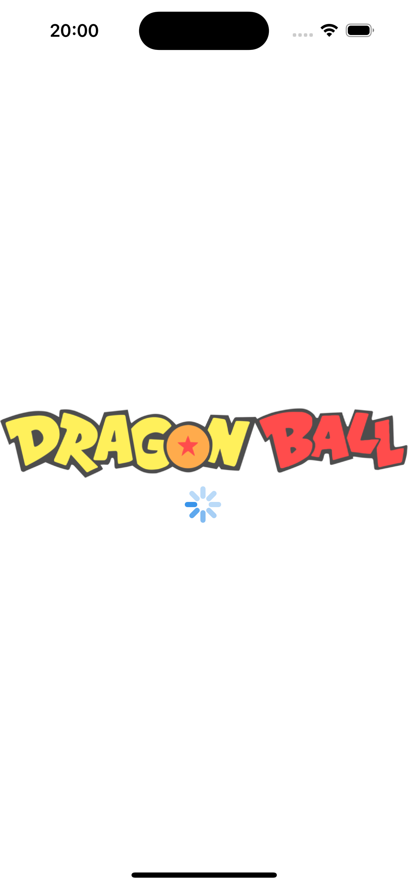
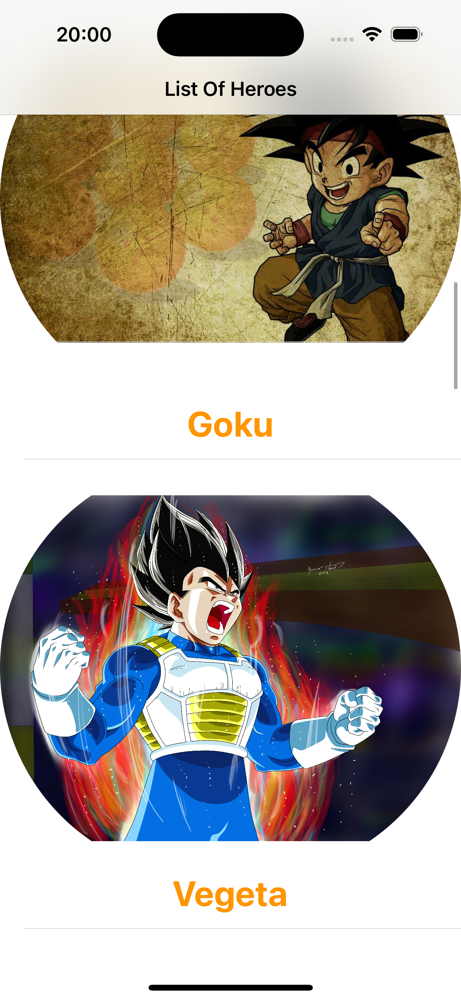
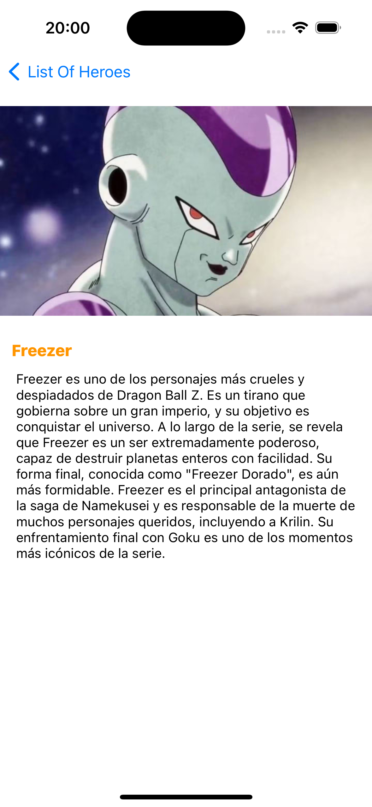

# AppPatronesDaniel

## Descripción
AppPatronesDaniel es una aplicación de muestra desarrollada utilizando el patrón de diseño MVVM (Modelo-Vista-ViewModel). La aplicación muestra un listado de personajes de Dragon Ball y permite ver información detallada de cada uno de ellos.

## Funcionalidades
- Muestra un listado de personajes de Dragon Ball en la pantalla principal.
- Permite ver información detallada de cada personaje al hacer clic en ellos.

## Capturas de pantalla

## Arquitectura
La aplicación sigue la arquitectura MVVM (Modelo-Vista-ViewModel):
- **Modelo (Model):** Representa los datos y la lógica de negocio de la aplicación. En este proyecto, incluye los modelos de datos de los personajes de Dragon Ball.
- **Vista (View):** Representa la interfaz de usuario de la aplicación. En este proyecto, incluye las vistas implementadas en los archivos `.xib`.
- **ViewModel:** Actúa como un intermediario entre la vista y el modelo. En este proyecto, incluye los view models que manejan la lógica de presentación y la interacción con el modelo.

## Requisitos
- iOS 13.0+
- Xcode 12.0+
- Swift 5.0+

## Instalación
1. Clona el repositorio en tu máquina local.
2. Compila y ejecuta la aplicación en el simulador o en un dispositivo iOS.

## Contribuciones
Las contribuciones son bienvenidas. Si encuentras un error o tienes alguna mejora, no dudes en abrir un *issue* o enviar un *pull request*.

## Créditos
Desarrollado por [Daniel Cazorro Frías](https://github.com/danielcazorrop)

## Licencia
Este proyecto está bajo la Licencia MIT. Consulta el archivo `LICENSE` para obtener más información.
